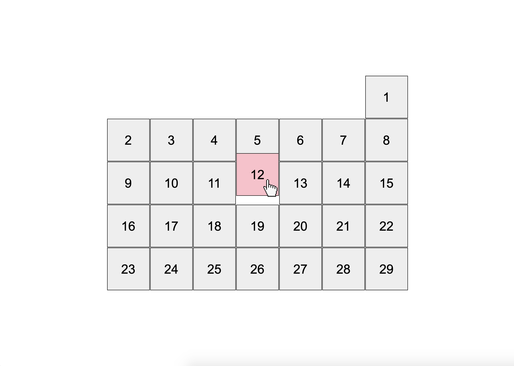

# Calendar
Replace `<your_account>` with your Github username and copy the links to Pull Request description:
- [DEMO LINK](https://semchuk-rodion.github.io/layout_calendar/)
- [TEST REPORT LINK](https://semchuk-rodion.github.io/layout_calendar/report/html_report/)

___
> Follow [this instructions](https://github.com/mate-academy/layout_task-guideline#how-to-solve-the-layout-tasks-on-github)

- Write styles in `src/styles/main.scss` instead of `src/style.css`.
- This task does not have tests so you need to check if it works as expected manually.
___

## ❗️❗️❗️ DON'T FORGET TO PROOFREAD YOUR CODE WITH [CHECKLIST](https://github.com/mate-academy/layout_calendar/blob/master/checklist.md) BEFORE SENDING YOUR PULL REQUEST❗️❗️❗️

## Task
Display a calendar in the middle of the screen. Use SCSS and follow BEM. Don't use JS.

- Create a markup for the calendar block with 31 days inside
  - DON'T add numbers in HTML (you will do it using CSS)
- Each day is a grey (`#eee`) `100px` square (including 1px black border)
  - Add a number (`Arial 30px`) in the center of each day using `::before` and [@for](https://sass-lang.com/documentation/at-rules/control/for)
- Use flex with `1px` gap and limit its width to exactly 7 columns + `10px` paddings
  - Don't use hardcoded `px` values if they are used several times
  - Use properly named variables to make all the calculations more clear.
- Implement `start-day` modifier for the `calendar` with `mon`, `tue`, `wed`, `thu`, `fri`, `sat` and `sun` values
  - Use [@each](https://sass-lang.com/documentation/at-rules/control/each) to create all the modifiers
  - The month should start at the correct column (Monday is the 1st, Friday is the 5th)
  - You can just add correct `margin-left` for the first day
- Add a modifier `month-length` for the `calendar` with values 28, 29, 30 and 31 (use `@for`)
  - It sets the last day to show (use [nth-child](https://css-tricks.com/how-nth-child-works/))
- On hovering over a cell, the cursor should become pointer.
- The hovered cell has to become pink
  - (**Optional**) Move it up by `20px` (use `transform`)
  - (**Optional**) both of these properties are to be animated with the duration of half a second.

--> [CHECKLIST](https://github.com/mate-academy/layout_calendar/blob/master/checklist.md)

## Here is a preview:
.
